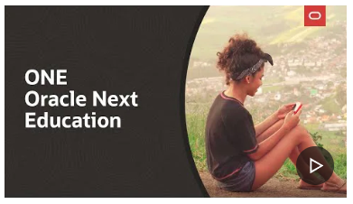
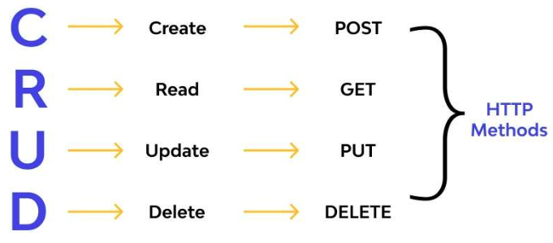
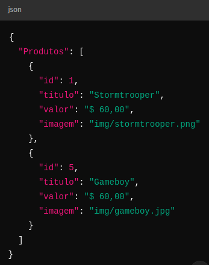
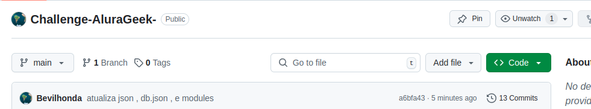
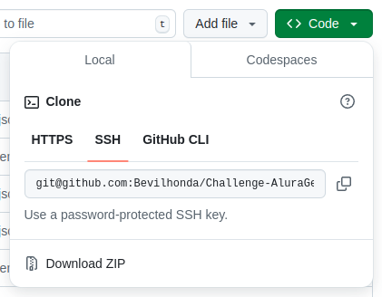
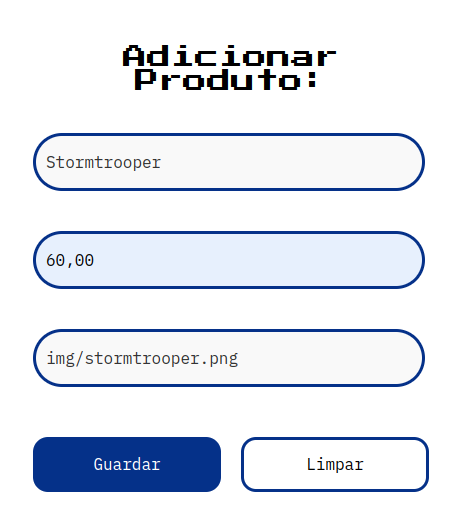

## Hi, I'm Marcelo Bevilacqua De Andrade 💻

<h1 align="center"> Projeto Challenge AluraGeek  - Oracle ONE + Alura </h1>

 📜  Projeto Challenge AluraGeek </a> 📜 

 👋 Sejam bem-vindos ao meu projeto , você vai conhecer mais sobre o:
 

 <strong>APRENDENDO NA PRÁTICA ATRAVÉS DO CURSO INICIANTE EM PROGRAMAÇÃO 
T7-ONE,DISPONIBILIZADO PELA PLATAFORMA ALURA EM PARCERIA COM A ORACLE .</strong>

Através da inscrição para a seleção de candidatos no site 
  ,
  fui selecionado e presenteado com uma bolsa para este curso oferecido entre uma 
  parceria da Oracle Next Educadion e Alura, O ONE é um programa de educação e 
  empregabilidade com objetivo social de capacitar pessoas em tecnologia e conectá-las
   com o mercado de trabalho por meio de empresas parceiras.

   
     

</strong> 💛 https://cursos.alura.com.br e https://www.oracle.com/br/education/oracle-next-education/ 🧡 e disponibilizado de forma gratuita para a comunidade. 

   
 💎 O objetivo principal é colocar em prática algumas das principais ferramentas para 
   a construção de paginas web:
    <strong> HTML, CSS, JAVASCRIPT</strong> 
    através de aulas dinamicas e intuitivas com exemplos práticos e exercicios ,
   e criar um CRUD para que nossa loja de Games funcione conforme desafio do projeto.
  

   
O que é CRUD ? 
 

   
    
        

Reservando pelo menos 4 horas por dia foi possível concluir a primeira etapa 
que foi dividida entre os cursos de 📚  HTML  📚 CSS 📚 JS ,  e assim aprender
  <strong> Lógica de programação</strong>.Após essa etapa cheguei na 
  <strong>Terceira fase </strong> chamada <strong>
  Praticando Front End : Desafio Challenge AluraGeek </strong>, 
  em que o desafio é criar uma loja virtual de Games conforme orientações passadas nas aulas. 

E para esta jornada tivemos uma equipe de peso ministrando as aulas, que foram eles :  

    

Com essa terceira etapa concluida foi possível compreender 👣 passo a passo 👣 
como são utilizadas algumas  🛠️ ferramentas 🛠️ de criação no Javascript para a 
implementação de um CRUD em nossa loja de Games.

   

<h1 align="center"> ⚡ 🛑 O Desafio</h1>

   

<h2 align="center">Praticando Front End : Challenge AluraGeek</h2>

Ao final do curso de Front End foi disposto um desafio chamado de Challenge,
 e criar um Challenge AluraGeek.O objetivo é criar uma loja de Games .

Após desenvolver todo o HTML e CSS de acordo com o modelo do FIGMA e seguindo as
 etapas do TRELLO , chegou a hora de MOCKAR uma API. 

<h2 align="center"> O que é MOCKAR API ? </h2> 

 
  

 

🔺Temos de simular de alguma forma os dados enviados pelo backend, ou seja,
 dizemos que estamos trabalhando com mocks ou “mockando” o backend. Mock nada mais é que 
 o nome dado para um conteúdo inventado e utilizado apenas como um marcador de posição. 

 Existem várias formas de se fazer isso. Uma delas, é pelo 
<h1> <strong> json-server.</strong> </h1> 

Resumidamente, o json-server vai simular uma API REST, com todos os endpoints 
de um recurso: GET, POST, PUT e DELETE. Assim, o nosso frontend consome essa API simulada, 
possibilitando a criação de toda a camada HTTP da aplicação. 

 <strong>👣 passo a passo 👣 </strong>
 

Criar um Arquivo de Dados.

Crie um arquivo <strong> db.json </strong> na raiz do seu projeto. Este arquivo 
conterá os dados que você deseja mockar.

<strong> Veja o exemplo: </strong>

 

 

 

O json-server é uma ótima ferramenta para estar no cinto de utilidades de todas as 
pessoas desenvolvedoras. Se você quiser desvendar todo o potencial desse pacote,
pode conferir a
<a href="https://github.com/typicode/json-server#getting-started">documentação completa aqui</a>.

  
<h3 align="center">🔺Tecnologias usadas 🎯</h3>

🔹 <strong>Html</strong> 
🔹 <strong>CSS</strong> 
🔹 <strong>Javascript</strong> 
🔹 <strong>Git</strong> 
🔹 <strong>Github</strong> 

   

<h3 align="center">🔺Como fazer download deste projeto <strong>👣 passo a passo 👣 </strong> </h3> 

 🛑 Em meu repositorio Challenge AluraGeek clique no botão verde escrito
 <strong> CODE </strong>
 

     
 
🛑 Ao abrir a caixa de opções clique em  
 <strong> DOWNLOAD ZIP </strong>
 

     
 
🛑 Lembre-se que você precisa ter instalado o json-server ,
  lembrando que o json-server é um pacote NPM que pode ser instalado globalmente 
  em ambientes que possuam o Node.JS instalado. 

 
 
Extraia o arquivo e abra ele no VSCODE ,clique em TERMINAL e NOVO TERMINAL. 

 
Execute o comando : <strong>json-server db.json</strong>

 
se apareceu essa mensagem :

     
 
É porque tudo ocorreu bem 

 
Abra o arquivo HTML em uma nova aba , ou se você tem a extenção LIVE SERVE no VSCODE 
 abra o arquivo HTML com o LIVE SERVER.

 
Feito isso irá abrir a pagina da loja Alura GEEK e você pode excluir um card ,
  ou incluir um novo card de acordo com a imagem que estão na pasta IMG do projeto 

      
  
Para incluir um novo card ,no campo <strong> ADICIONAR PRODUTO </strong>
  preencha os campos de nome , valor e imagem. De um nome ao produto , digite o valor do produto , e no 
  campo de imagem... coloque o caminho de onde está a imagem no projeto, veja o exemplo : 

      
 

<h1 align="center"> 

✅   

</h1>

    

<h2 align="center">💡 ‼️ ESTE REPOSITÓRIO FOI CRIADO PARA O PROJETO CHALLENGE AluraGeek E PARA FINS DE ESTUDO. ‼️
 </h2>
 <h2 align="center"> <strong> Marcelo Bevilacqua de Andrade  </strong></h2>

    

 <h4>🛑🎨 Fontes/Imagens</h4>
 ✅  https://cursos.alura.com.br  
 ✅  https://www.oracle.com/br/education/oracle-next-education/ 
 ✅  https://vercel.com  

 

